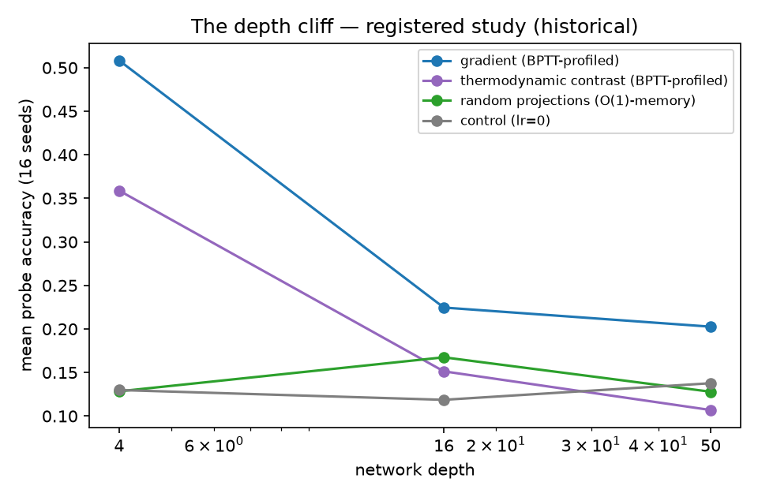

# RESULTS — Capabilities First, History Second

> **TODO10 R10.2.9.** The front section states what each ontology axis *is*,
> the one-line swap that exercises it, and the live demonstration that
> re-shows it at HEAD. The back section is **historical corroboration**:
> registered studies kept for context, never load-bearing. The front never
> cites the back. A claim stands only while its demo test re-demonstrates it
> — `pytest tests/integration/ -k demo`.

## Front: the axes, live

| Axis | What the abstraction is | The one-line swap | Live demonstration | Figure |
|------|------------------------|-------------------|--------------------|--------|
| **G** (Geometry) | Topology and routing of computational units — `RecurrentGeometry` here: hidden state is recurrently connected; `ConvGeometry` routes im2col patches through the substrate's operator (physics stays in the loop), its shared kernels carrying translation structure | `geometry=FeedforwardGeometry(GeometryConfig.feedforward(...))` ↔ `ConvGeometry(GeometryConfig.conv(...))` in `compose_joint_system` | D1 — a fully composed six-axis system trains on MNIST to ≈ 0.84 in one epoch over the capped train stream (`test_demo_compose_6axis.py`); config round-trips (L6); the 5-D build trained identically gives bitwise-equal θ (J1). D8 — one swapped G-axis argument, identical wiring, capacity-matched arms (3,940 vs 3,818 params): both learn (≈0.68 / 0.72), and on digits shifted 4 px the conv arm retains ≈0.44 vs ≈0.20 — structure, not capacity (`test_demo_geometry_swap.py`) | [d1](figures/d1_compose_6axis.png), [d8](figures/d8_geometry_swap.png) |
| **D** (StateDynamics) | Forward evolution and settling — `EnergyMinimizationDynamics` relaxes free/nudged phases; `SpikeIntegrationDynamics` settles layer-wise LIF membranes (spike at threshold, reset), the settled membrane carrying activity between layers; `ErrorPredictiveCodingDynamics` (ePC, Goemaere et al., arXiv:2505.20137, ICML 2026) reparameterizes the dynamics in prediction errors εᵢ so one reverse-mode sweep carries the output-loss gradient to every layer unattenuated | `dynamics=InstantaneousDynamics()` ↔ `SpikeIntegrationDynamics(StateDynamicsConfig.spike_integration(max_steps=10))`; ePC ↔ layered sPC (`test_demo_epc_fast_settle.py`) | D1 — energy-based settling trains end-to-end through the same trainer; D7 — one swapped D-axis argument, identical wiring: both arms learn (≈0.87 / 0.85), the trained LIF network fires visibly (≈1.8k counted spikes per settle) and its membranes come back ≤ threshold 1.0 (`test_demo_spike_settle.py`); D12 — ePC's free-phase equilibrium is the feedforward pass itself (bitwise), its nudged settle moves every hidden layer where the layered sPC settle moves none, and it trains on 1/3 the settle budget (`test_demo_epc_fast_settle.py`) | [d1](figures/d1_compose_6axis.png), [d7](figures/d7_spike_settle.png), [d12](figures/d12_epc_fast_settle.png) |
| **C** (CreditAssignment) | Error routing / pseudo-gradient computation; every rule is one constructor argument on the same coordinate | `credit=BackpropCredit()` ↔ `ThermodynamicContrast()` ↔ `RandomProjectionsCredit()` — everything else byte-identical | D2 — all three rules learn the same task through one trainer (`test_demo_swap_credit.py`): ≈ 0.87 / 0.86 / 0.62 vs 0.10 chance (600-batch cap, re-pinned 2026-09-02) | [d2](figures/d2_swap_credit.png) |
| **M** (Plasticity) | Mechanism making the computational rule itself a dynamical variable; `NullPlasticity` is the zero-extension slice | `plasticity=NullPlasticity()` ↔ `RoutingPlasticity()` on the segmented A→B stream | D3 — across a task switch, routing visibly retains segment-A competence that null forgets (10-seed calibration, mastery precondition asserted first) (`test_demo_swap_plasticity.py`) | [d3](figures/d3_swap_plasticity.png) |
| **S** (Substrate) | Physical state space — precision, noise, sparsity constraints; `MemristiveSubstrate` realizes signed weights as differential-pair conductances (per-device range [0, 1], int8 straight-through quantization) with IR-drop state noise; `NeuromorphicSubstrate` makes `sparsity` functional — the state is thinned to the active spike set each forward step (each element survives with probability `1 − sparsity`, dropout keyed off the ambient seeded stream so paired draws cancel in diffs — C9 passivity) | `create_backprop_mlp(...)` ↔ `create_memristive_mlp(..., noise_level=8.0)` ↔ `create_neuromorphic_mlp(...)` (D1–D5 all run on the digital substrate through the same `Substrate` API — no special-casing anywhere in the trainer) | D6 — one swapped substrate argument, identical wiring: digital learns (≈0.91), mild IR-drop learns less (≈0.78), severe IR-drop walls at chance (≈0.12), mild spike dropout learns (≈0.70, probe zeros 0.50), default spike sparsity walls (≈0.11, probe zeros 0.95); the record carries each arm's probe state-zeros — the dial itself; staircase re-pinned 2026-09-02 under the differential-pair + functional spike-dropout semantics (`test_demo_substrate_swap.py`) | [d6](figures/d6_substrate_swap.png) |
| **U** (ParameterUpdate) | Slow, persistent parameter consolidation Δθ — and the swap matters: Muon-class orthogonalized updates (SVD polar factor of the momentum, `RiemannianOrthogonalUpdate`) rescue the local credit rules to BP-grade where Euclidean stalls | `update=EuclideanUpdate(...)` ↔ `RiemannianOrthogonalUpdate(ParameterUpdateConfig.riemannian_orthogonal(step_size=0.02, momentum=0.9))` | D13 — one swapped U-axis argument across three credit rules: FF×Muon and PEPITA×Muon train to ≈ 0.85 where FF/PEPITA×Euclidean reach ≈ 0.26–0.61, matching BP×Muon (≈ 0.85) — local credit × orthogonal update is real at demo scale (single seed; multi-seed pending). Instrument history locked: the polar factor is SVD-based (reduced QR measured cos ≈ 0 with the gradient and trained at chance) and the momentum is accumulated before orthogonalization (`test_demo_uaxis_muon_swap.py`, 2 ratchets) | [d13](figures/d13_uaxis_muon_swap.png) |

### The two categorical guarantees

| Guarantee | What the runner watches | Demonstration | Figure |
|-----------|------------------------|---------------|--------|
| **The memory profiler is honest** | Under a 0.015 MiB budget the BPTT-profiled arm is walled at every depth *before training*; the O(1)-memory arm runs and learns | `test_demo_memory_budget.py` — verdicts are profile arithmetic, walled cells produce no walk | [d4](figures/d4_memory_budget.png) |
| **Frozen θ is bitwise** | θ's SHA-256 identical across freeze → adapt ψ on A → switch to B → restore; the restored ψ-system reproduces stage-A accuracy *exactly* | `test_demo_z3_frozen_theta.py` (J2, demonstrated, not just locked) | [d5](figures/d5_z3_frozen_theta.png) |
| **The stability guard is calibrated (PR-5)** | Demo-harvest ROC over the demo-suite coordinate family: windowed growth reads 1.0 on every known-good arm (bounded activations) and ≥ 1.06 on every verified-divergent run — the deployed τ = 1.029 is lossless (0% false-kill, 100% kill; the max-margin recalibration lands within 0.005% of it). `fast_proxy` is calibration-only: substrate noise inflates its good-arm gain (max ≈ 1454) past the diverged range (0.93–1.51) — infeasible. Per-probe cost 3.3×/10.2× a train step → the <10% overhead bar is met by the calibrated probe interval (34/102 episodes) | `tests/unit/core/test_stability_guard.py::TestPR5DemoHarvest` re-harvests and re-calibrates live; demo-scale record [stability_guard_pr5.json](figures/registered/stability_guard_pr5.json) (regenerate: `uv run scripts/calibrate_stability_guard.py --family pr5`) | — |

## Front: the failure manifesto (live refutations)

| Failure face | What dies, and how | Live demonstration | Figure |
|--------------|--------------------|--------------------|--------|
| **The depth wall (error-based credit)** | Under identical wiring, backprop decays through depth (0.72 → 0.50 → 0.11 at depths 2/4/8; flat across an lr grid 0.02–0.2 — not an lr artifact) and the local contrastive rule (sPC) walls at chance by depth 8 at this budget. **Skeptical audit (2026-09-04):** the sPC wall's mechanism under our layered settle is last-layer-only training — per-layer credit norms are exactly 0.00 for every hidden weight matrix (asserted live) — and budget softens it (0.21 at 60 settle steps, audit probe). Treat the wall as the random-feature readout boundary of this instrument regime, not settled depth physics; whether a hidden-layer contrast is achievable in a layered settle at all is OPEN | `test_demo_failure_manifesto.py` — same pipeline, same terms, MNIST quick-mode, 60 batches | [f1](figures/f1_failure_manifesto.png) |
| **μPC gives no lift under our trainer** | Depth-scaled init rescues nothing at any depth (0.124 vs 0.105 at depth 8). OPEN, not refuted: the jpc-faithful port (Adam, β grid, steps=H) is the remaining instrument gap — never quote "μPC refuted" | same demo test; μPC arm ≤ sPC arm + 0.05 asserted live | [f1](figures/f1_failure_manifesto.png) |
| **Runaway gain (unnormalized local chain)** | The hebbian tile chain's init forward gain compounds super-exponentially: norm ratio last/first 1.4 → 7.2e2 → 3.2e5 at depths 10/50/100; one local update NaNs it (probe: `scripts/probes/deep_hebbian_chain.py`) | same demo test asserts the ratio grows monotonically and exceeds 100 at depth 100 | [f1](figures/f1_failure_manifesto.png) |
| **Subspace collapse (normalized Oja chain)** | Activity renorm kills the runaway gain, but the 10-class readout decays 0.99 → 0.23 toward chance (0.1) while the first layer stays ≈ 1.0 — the chain transmits its dominant direction and discards the rest | same demo test; collapse real (drop > 0.3) yet every depth above chance | [f1](figures/f1_failure_manifesto.png) |

| **The spiking plateau, audited (R11.5.5 slot filled)** | Two separated claims, same pipeline: (1) **the confound** — with default init, hidden LIF layers are silent (spike fraction < 1e-4 past layer 1) so every hidden weight matrix receives exactly zero STDP gradient and the readout is frozen: historic "spiking at chance" numbers measured a silent network, not STDP; (2) **the plateau, after the fix** — with `init_scale=1.0` every layer spikes (0.15–0.45) and gradients reach every matrix, yet supervised accuracy stays at chance (pure STDP has no error path: `TemporalTraceCredit` never consumes the loss — a category fact, not a defect) and unsupervised STDP training actively collapses class structure (centroid readout 0.36 → 0.18): the runaway-gain pathology, spiking edition. A supervised spiking claim needs an error term (e.g. reward-modulated STDP) — OPEN | `test_demo_spiking_plateau.py` | [f2](figures/f2_spiking_plateau.png) |

## Back: historical corroboration

> **Everything below is history.** These are registered research-track runs
> (preregistered scope, fixed seeds, stored artifacts under
> `benchmark_results/`). They show the same effects as the front section at
> larger scale *as of the date they ran* — they are not library claims, and
> no front-page statement leans on them. Provenance status is stated per
> artifact; "provenance unknown" means the file records no git commit.

| Study | Artifact | Preregistered scope | Headline numbers | Provenance |
|-------|----------|--------------------|------------------|------------|
| Retention (forgetting) trial | `benchmark_results/forgetting_registered.json` | 16 seeds, A40/B40 segmented stream, null vs fast_weights vs routing, planted lr=0 control | Routing retains segment A where null collapses; d = −1.90 on retained accuracy at the registered scale | git commit **unknown** |
| Memory-budget trial | `benchmark_results/memory_budget_registered.json` | 5 seeds × depths 4/16/50 × budgets 0.015/0.25/0.45 MiB; walled arms never walked | Feasibility grid reproduces the O(1)-vs-O(depth) wall; walled-regime competence is shallow-only | git commit **unknown** |
| Walled-regime boundary map | `benchmark_results/boundary_map_pilot.json` | Depths 4–50, independent seeds | Competence boundary between depth 4 (probe 0.396, d = +4.80) and depth 6; depth-4 replicates the registered 0.406 | git commit **unknown** |
| Deep-credit trial | `benchmark_results/deep_credit_registered.json` | 16 seeds × depths 4/16/50 | The depth-50 cliff: BPTT-profiled arms lose competence below the wall; O(1)-memory arms degrade gracefully ([figure](figures/registered/deep_credit_cliff.png)) | git commit **unknown** |
| Z3 fixed-weights manifest | `benchmark_results/z3_fixed_weights/manifest.json` | Meta-train 50 epochs, eval 20/task, 3 seeds, CUDA | ψ-mediated task switching at exact Δθ = 0 with θ-hash audit | `config_sha256` + `git_commit` **recorded** |

**Registered-scale figure (historical):**

*Drawn from `benchmark_results/deep_credit_registered.json` (16 seeds × depths
4/16/50): the BPTT-profiled arms hold competence at depth 4 and collapse past
the boundary; the O(1)-memory arm and the lr=0 control sit near chance
throughout. Rendered at HEAD by `scripts/render_registered_figures.py`
(provenance sidecar: `figures/registered/deep_credit_cliff.json`); the source
runs record no git commit — provenance unknown.*

**What the back section does not mean:** none of these numbers is a claim
about the library's current behavior. The front section's demo tests are the
only live evidence; this section exists because the registered studies'
*designs* (preregistration, controls, seed counts) remain the right
instruments at research scale, where registered-scale figures — e.g. the
depth-50 cliff, unreachable at demo scale by design — live.
